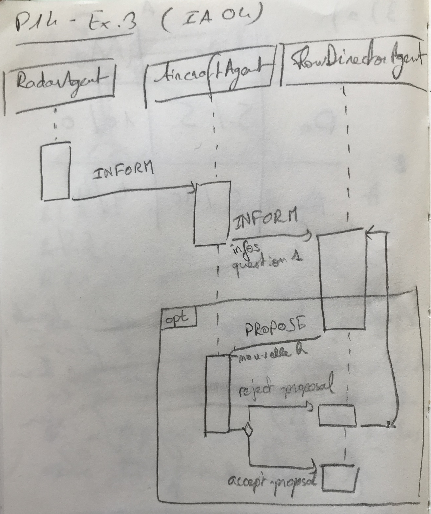

# IA04 - Final P2014

## Exercice 1 (8 pts)

_1\. Donner une définition de la plateforme WADE._

WADE est un sur-ensemble de JADE, une plateforme basée sur JADE facilitant le workflow (?).

_2\._ L'environnement peut être statique ou dynamique, épisodique ou séquentiel, discret ou continu, compétitif ou collaboratif, déterministe ou non-déterministe _(voir cours CA-ia04-interaction-agent)_.

_3\._ On peut définir un MOM comme une plateforme dans laquelle les entités communiquent de façon asynchrone et persistante.

_4\. a._

|    | A'  | B'  |
|----|-----|-----|
| A  | 0/2 | 2/3 |
| B  | 1/5 | 1/5 |

* A : E1 fait de la pub
* B : E1 ne fait pas de pub
* A' : E2 fait de la pub
* B' : E2 ne fait pas de pub

Premier équilibre :
* Si E1 fait de la pub, E2 a intérêt à ne pas en faire.
* Si E2 ne fait rien, E1 a intérêt à faire de la pub.

Second équilibre :
* Si E2 fait de la pub, E1 a intérêt à ne pas en faire.
* Si E1 ne fait rien, E2 peut faire ce qu'il veut, ça ne changera rien.

_b._ Si E2 fait de la pub, il n'a rien à y gagner, mais il risque d'y perdre si E1 décide également d'en faire. E2 aura alors comme stratégie de ne rien faire quoi qu'il arrive. Si E1 connaît les intentions de E2, il est dans son intérêt d'adopter une stratégie consistant à faire de la pub, car il aura un bénéfice de 2. S'il ne connaît pas ses intentions, autant qu'il ne fasse rien.

_5\._

* GET : Obtenir une ressource
* POST : Créer une ressource
* PUT : Modifier une ressource
* DELETE : Supprimer une ressource

* Obtenir description : `www.site.fr/documents/id` -> GET sur cet URL
* Modifier une description : `www.site.fr/documents/id` -> PUT sur cet URL
* Créer une description : `www.site.fr/documents/` -> POST sur cet URL

## Exercice 2 (6 pts)

_1._
On a trois entités :
- **Leader** : Son rôle principal est de parcourir l'espace en déposant des traces.
- **Suiveur** : Leur rôle est de suivre les traces lorsqu'ils en trouvent en se déplaçant vers la trace d'unités maximale.
- **Trace** : La trace à un attribut unités qui est décrémentée à chaque itération. Une trace doit se détruire lorsque unités atteint 0.

_2._
```python
leader.step:
    position = getPosition()
    createTrace(position, 10)
    # Les caractéristiques du mouvement ne sont pas données, on considère que transform les implémente
    newPosition = position.transform(1)
    moveTo(newPosition)
```

```python
follower.step:
    # Renvoie la position de la trace dans la zone visible avec le plus d'unités
    newPosition = searchTrace()
    if newPosition is Nothing:
        newPosition = getPosition().transform(1)
    moveTo(newPosition)
```

```python
trace.step:
    units = units - 1
    if units <= 0:
        delete() # Détruit l'agent
```

## Exercice 3 (6 pts)
_1\._ `AircraftAgent` transmet au `FlowDirectorAgent`:
- l'heure d'arrivée estimée
- la quantité de carburant restante
- la vitesse minimum d'atterrissage
- la vitesse maximum d'atterrissage
- l'intervalle de temps entre 2 atterrissages (ou le type d'avion, vu que cet intervalle en dépend)

Voici un exemple de donnée transmise. Le carburant est donné en litres, les vitesses minimum et maximum en m/s, et l'intervalle de temps entre 2 atterrissages en secondes.
```json
{"heure":"22:10:00", "carburant": 100, "vitesseMin": 3, "vitesseMax": 12, "intervalle": 600}
```

_2\._


_3\._
**Behaviour permettant d'établir le planning des avions :**
Ce behaviour est un CyclicBehaviour qui attend des messages ayant le performatif INFORM provenant des AircraftAgent. Il n'y en a qu'un pour le FlowDirectorAgent. Il calcule l'heure d'atterrissage et vérifie s'il n'y a pas d'encombrement. S'il y en a un, il instancie le prochain beheviour.

**Behaviour permettant de gérer un encombrement :**
Ce behaviour est un permettra de gérer un cas d'encombrement en proposant une nouvelle heure d'atterrissage. Il peut y en avoir plusieurs et il se termine lorsque l'agent AircraftAgent a accepté la proposition. Sinon, il tente de nouvelles possibilités d'heures d'atterrissage.

---
