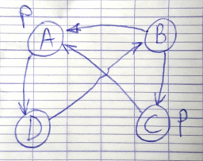

# IA04 - Final P2015

## Exercice 1 (12 pts)

_1\. a._



`♦p` est valide dans B et C.

_b._ Oui. On veut vérifier `♦p` pour tous les mondes w tels que R(w, A) - c'est-à-dire B, C et D (A n'a pas accès à lui-même). `p` est valide dans A, donc par définition `♦p` est valide dans tous les mondes qui ont accès à A.

_c._

* `■p` n'est pas valide dans A car A a accès au monde D, où `p` n'est pas vraie.
* `■p` n'est pas valide dans D car il a accès à B, où `p` n'est pas vraie.
* `■♦p` est valide dans A, car il a accès à A, C et D où `♦p` est vraie.

_2\. Répondre par vrai ou faux :_

_a. JADE est un sur-ensemble de WADE._ **FAUX,** WADE est un sur-ensemble de JADE.

_b. WADE traite de BPM (Business Process Management)._

_c. Il n'est pas possible de modéliser un Workflow par un SMA._

_d. Les agents WADE s'enregistrent automatiquement auprès de l'agent DF._

_3\. a._

|    | D    | A    |
|----|------|------|
| D' | 5/5  | 0/10 |
| A' | 10/0 | 4/4  |

* **D** : docile
* **A** : agressif

Rationnellement les agents vont choisir une stratégie **agressive**, car ils obtiendront 10 ou 4, et s'ils choisissent une stratégie docile, ils obtiendront 5 ou 0. Plus de gain potentiel et moins de risque d'être agressif.

_b._

|    | D    | A       |
|----|------|---------|
| D' | 5/5  | 0/10    |
| A' | 10/0 | -5/-5   |

Premier équilibre :

* Si A1 est docile, A2 a intérêt à être agressif.
* Si A2 est agressif, A1 a intérêt à être docile.

Second équilibre :

* Si A1 est agressif, A2 a intérêt à être docile.
* Si A2 est docile, A1 a intérêt à être agressif.

Dans chacun de ces deux cas on a un **non-regret** de chaque partie considérant l'action faite par l'autre, chacun fait la meilleure action compte tenu de celle choisie par l'autre.

_4\. a_

```
SELECT ?name
WHERE {
  ?agent rdfs:label ?name
  ?pbBy a ont:publishedBy
  ?pbBy rdfs:range ?agent
  ?pbBy rdfs:domain ?doc
  ?hasFormat a ont:hasFormat
  ?hasFormat rdfs:domain ?doc
  ?hasFormat rdfs:range ?format
  {?format a ont:video}
  UNION
  {?format a ont:texte}
}
```

Autre solution :
```
SELECT ?name
WHERE {
  ?agent ont:hasName ?name
  ?document ont:publishedBy ?agent
  ( ?document ont:Format ont:video OR
    ?document ont:Format ont:text
  )
}
```

_b._

```
SELECT ?title
WHERE {
  ?hasTitle a ont:hasTitle
  ?hasTitle rdfs:domain ?doc
  ?hasTitle rdfs:range ?title
  ?pbBy a ont:publishedBy
  ?pbBy rdfs:domain ?doc
  ?pbBy rdfs:range ?agent
  ?hasName a ont:hasName
  ?hasName rdfs:domain ?agent
  ?hasName rdfs:range ?name
  ?name="UTC"
}
```

Autre solution
```
SELECT ?titre
WHERE {
  ?document ont:hasTitle ?titre
  FILTER (regex (?title, "UTC"))
}
```

## Exercice 2 (3 pts)

_1\._

À chaque itération, tous les steppables doivent être exécutés au moins une fois. On peut donc déterminer les ordres d'appels suivants :

| Iteration 1 | Iteration 2 |
|-------------|-------------|
| a, t        | a, t        |
| a, t        | t, a        |
| t, a        | a, t        |
| t, a        | t, a        |

Les ordres d'appels **a, a, t, t** et **t, t, a, a** ne sont pas possibles, car la première itération ne serait alors pas encore finie lorsqu'on appellerait le step du même agent pour la deuxième fois.

_2\._ Le niveau minimal d'intensité pour qu'elle soit visible par un agent est 2. En effet, s'il est à 1, et que la méthode step de la trace s'éxécute avant celle de l'agent, l'intensité passera à 0 et la trace ne sera plus détectable par l'agent quand sa méthode step se lancera.

_3\._ Les deux traces peuvent avoir la même intensité :   
__Itération 1 :__
* l'agent 1 laisse une trace t1 d'intensité maximale et se déplace sur une autre case

__Itération 2 :__
* l'agent 1 laisse une trace t2 d'intensité maximale sur la case où il se trouve
* l'agent 2 scanne son environnement : il voit donc deux traces de niveau d'intensité maximal.
* la trace t1 diminue d'intensité.

## Exercice 3 (5 pts)

*Etape 1 : Informations transmises par clientAgent (application mobile pour passer une commande) vers commandeAgent (agent qui gère les commandes)*

* produit commandés : les produit sont des instances de la classe Produit qui possède comme attribut un nom (chaîne de caractère permettant de l'identifier), un prix unitaire, un temps de préparation.
* quantité pour chaque produit.

La chaîne de caractère en valeur de "produit" correspond à la chaine de caractère identifiant un Produit.

```json
{
  "commande": [
    {
      "produit": "sandwich",
      "quantite": 1
    },
    {
      "produit": "panini",
      "quantite": 1
    }
  ]
}
```

*Etape 2 : Indiquer au cuisinier à quelle heure commencer à préparer les commandes. L'heure varie en fonction de l'heure à laquelle le client souhaite venir chercher sa commande, le temps de préparation et le nombre de commandes en attente.*

On a défini dans les instances de la classe Produit, le temps de préparation de chaque item pouvant être commandé.
On peut ainsi facilement calculer le temps total de préparation d'une commande en additionnant le temps de préparation de chaque produit de la commande.
S'il y a une seule commande à préparer, l'heure à laquelle le cuisinier doit commencer à préparer est l'heure à laquelle souhaite venir le client à laquelle on soustrait le temps de préparation + un délai pour prévenir les différents imprévus (par exemple 30s par produit commandé).

Plus il y a de commandes en attente et plus le début de préparation de la commande doit être tôt.

Lorsqu'on crée un agent `commandeAgent`, on initialise un `WakerBehaviour` qui démarrera qui notifiera le cuisinier en temps voulu.  
Pour cela, on a ajoute un agent Cuisinier, installé sur un appareil utilisé par le cuisinier (ordinateur ou téléphone).  
C'est l'agent `Cuisinier` qui est destinataire du message envoyé par commandeAgent dans le `WakerBehaviour` lorsqu'une commande doit être démarrée.  
Ce message contient les caractéristiques de la commande (produits à préparer et en quelle quantité + heure à laquelle la commande doit être terminée).


*Etape 3 : Gestion des stocks*

Dans la classe Produit, on ajoute les champs :
* `quantiteEnStock` :  cette quantité est mise à jour à chaque fois qu'un produit est commandé.
* `stockMin` qui détermine la quantité minimum que l'on souhaite avoir en stock pour ce produit.
* `quantiteRecharge` : quantite d'articles commandés à chaque fois qu'une livraison est nécessaire.

Lorsque `quantiteEnStock` < `stockMin`, on démarre un behaviour qui demande une livraison de `quantiteRecharge` items de ce produit.

Les stocks sont gérés par un agent `Stock` qui possède un tableau avec toutes les instances de la classe Produit.
C'est lui qui possède un `OneShotBehaviour` permettant de demander la livraison d'un produit lorsque cela est nécessaire.

A chaque fois qu'une commande est passée (l'agent commandeAgent reçoit un message avec les caractéristiques de la commande), il envoie un message INFORM à l'agent stock précisant les produits commandés et en quelle quantité. L'agent stock gère ensuite et déclenche des demandes de livraison si besoin.


__Pb__ : Comment l'agent `commandeAgent` récupère les temps de préparation de chaque produit vu que les différents produits sont dans l'agent `Stock` ?  

*Etape 4 Diagramme d'échange de messages :*
