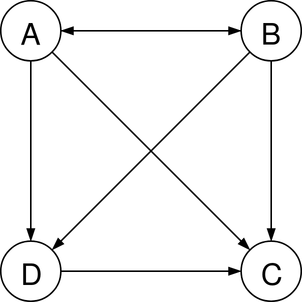
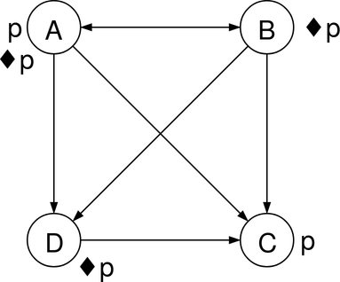
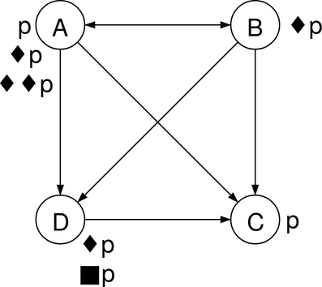

# IA04 - Final P2016

# Exercice 1 _(4 pts)_

_1\._ `<pré-condition, suppressions, ajouts>`

_2\._ `<pré-condition, post-condition>`

_3\._ Deux principes fondamentaux :

* Accès à toute ressource par une interface uniforme (GET, PUT, POST, DELETE)
* Toute ressource est identifiée par une URI.

_4\._ Deux différences :

* SOAP expose des opérations nommées, alors que REST expose des ressources
* SOAP utilise un langage WSDL, alors que REST n'utilise pas de langage spécifique.

_5\._ On obtient les documents suivants :

* Diagramme UML des use-cases
* Diagramme du SMA
* Diagramme de déploiement (hôtes physiques...)
* Table des fonctionnalités

## Exercice 2 _(3 pts)_

_1\._

_2\._ `♦p` est valide dans A, B, D, car ces trois mondes ont accès à au moins un monde où `p` est vraie. `♦p` n'est pas vraie dans C car C n'a pas accès à lui-même.

_3\._ `■p` est valide dans D, car `p` est vraie dans tous les mondes auxquels il a accès (c'est-à-dire seulement C).

_4\._ `♦♦p` est valide dans le monde A. Par contre, `■♦p` n'est pas valide dans A, car A a accès à C, dans lequel `♦p` n'est pas valide.

## Exercice 3 _(3 pts)_

### Matrice (1)

La stratégie dominante est la stratégie personnelle, car chaque agent a plus intérêt, quoi que fasse l'autre, à employer une stratégie personnelle.

Équilibre de Nash :

* Si A a une stratégie personnelle, B a intérêt à avoir une stratégie personnelle
* Si B a une stratégie personnelle, A a intérêt à avoir une stratégie personnelle

Une stratégie collaborative serait plus intéressante, car si les deux agents jouent le jeu, ils gagnent 200 de plus chacun.

### Matrice (2)

_N.B. : laquelle de ces deux réponses est la bonne ?_

#### Réponse 1

Il n'y a ici pas de stratégie dominante, car la stratégie la plus intéressante dépends de la stratégie de l'autre acteur. Si le premier acteur applique la stratégie personnelle, le second aura intérêt à appliquer la stratégie collaborative et vice versa.

#### Réponse 2

La moyenne des gains en suivant la stratégie personnelle dépasse largement celle des gains suivant la stratégie collaborative. Rationnellement les deux parties devraient choisir une stratégie personnelle.

Équilibres de Nash :

* Premier équilibre :
  * Si A joue personnel, B a intérêt à jouer collaboratif
  * Si B joue collaboratif, A a intérêt à jouer personnel
* Second équilibre :
  * Si A joue collaboratif, B a intérêt à jouer personnel
  * Si B joue personnel, A a intérêt à jouer collaboratif

La strat de base des deux agents est de jouer personnel, ce qui leur apporte 10 chacun. S'ils jouaient tous les deux collaboratif, ils obtiendraient 50 chacun.

## Exercice 4 _(4 pts)_

Non.

## Exercice 5 _(6 pts)_

Non.
