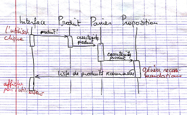

# IA04 - Médian P2013

**Note : Les réponses données ne sont que des suppositions personnelles, n'hésitez pas à corriger si elles comportent des erreurs.**

## Exercice 1 _(8 pts)_

_1\. Dans la méthode action d'un behaviour JADE, on a introduit une temporisation de 2 secondes afin de permettre que des messages soient arrivés pour que l'agent puisse prendre une décision. Montrer en quoi cette façon de faire est incorrecte. Quelle autre solution faut-il envisager ?_

Cela est incorrect, car un message n'arrive pas forcément au bout de deux secondes, on ne peut se permettre une telle supposition. De plus, on perdra du temps si les messages arrivent avant la fin des deux secondes. 
Pour faire prendre ses décisions à l'agent si et seulement si il a reçu un message, il suffit d'appeler la méthode _block()_ tant que le message que l'on reçoit est _null._

_2\. Donner au moins 6 attributs d'un message FIPA et leur signification._

- _performative_ : le type de message envoyé (REQUEST, FAILURE...)
- _sender_ : identité de l'émetteur du message
- _receiver_ : identité des destinataires du message
- _content_ : contenu du message
- _conversation-id_ : identifiant de conversation utilisé pour identifier les actes de la même conversation
- _language_ : langage avec lequel le contenu est exprimé

_3\. Citer les quatre méthodes REST principales. Quelle est leur signification ?_

- _GET_ : recevoir / lire une ressource
- _POST_ : créer une ressource
- _PUT_ : mettre à jour une ressource
- _DELETE_ : supprimer une ressource

_4\. Que définit-on principalement durant les quatre premières étapes de la phase d'analyse de la méthode de conception de systèmes multiagents JADE ?_

<<<<<<< HEAD
1. identification des use cases
2. identification des différents types d'agent
3. identification des fonctionnalités principales pour chacun des agents (résultat = table de fonctionnalités)
4. identification du réseau d'accointances (qui connaît qui)
=======
- Définition des besoins du système
- Définition des principaux types d'agents
- Définition de leurs comportements et de leurs fonctionnalités
- Définition des accoointances (relations entre les agents)
>>>>>>> 2b133f5eaba4f4a204d3e5271091d10a96bd555c

## Exercice 3 _(3 pts)_
_Un système multi-agents gérant des jeux de lettres possède un agent dictionnaire, uniquement capable de gérer une ou plusieurs structures représentant un ensemble de mots ou de caractéristiques concernant ces mots._

_Un deuxième agent est simplement capable de calculer la liste d’occurrences d’un mot, c’est-à-dire la structure indiquant pour chaque lettre du mot, le nombre de fois que cette lettre est présente. Par exemple la liste d’occurrences du mot « entier » est {(e,2),(i,1),(n,1),(r,1),(t,1)}. Deux anagrammes sont deux mots composés des mêmes lettres mais dans un ordre différent. Une anagramme du mot « entier » est par exemple le mot « inerte »._

_1\. Comment l’agent dictionnaire peut-il savoir si les mots « entier » et « inerte » sont des anagrammes ? On donnera le contenu des messages échangés et des attributs nécessaires à l'échange en expliquant leur utilité. L'agent dictionnaire peut demander simultanément plusieurs listes d'occurrence dans des messages différents._

Le dictionnaire envoie pour chaque mot un message de type _REQUEST_ à l'occurrenceur : l'un ayant pour contenu le mot _entier,_ l'autre le mot _inerte._ Il se met en attente de messages de type _INFORM._ Pour chacun des deux messages reçus, il stocke son contenu dans son attribut de type Mot (objet contenant deux attributs `String mot` et `ListeOccurrences occurrences`).

Lorsqu'il a reçu les deux messages, il compare les deux listes d'occurrences. Si elles sont identiques alors il sait que _entier_ et _inerte_ sont des anagrammes.

L'occurrenceur de son côté possède un _CyclicBehaviour_ qui attend des messages de type _REQUEST._ Lorsqu'il en reçoit un, il génère sa liste d'occurrences, et la renvoie à l'émetteur.

_2\. Que devrait faire l’agent dictionnaire pour déterminer tous les anagrammes d’un mot ?_

Envoyer simultanément à l'agent Occurrenceur un message de performatif REQUEST pour chacun des mots contenus dans le dictionnaire.
Comparer les listes d'occurrences reçues pour chacun des mots avec celle générée en réponse pour le mot dont on veut connaître les anagrammes.

## Exercice 4 _(5 pts)_

_Une entreprise de grande distribution possède un site Web en ligne géré par un système multi-agents. Le site permet à un utilisateur de naviguer dans les produits, de voir leurs caractéristiques et d’acheter des produits au travers d’un panier. Régulièrement, l’interface Web du client lui propose des produits similaires à ceux qu’il a déjà achetés ou qui pourraient l’intéresser._

_1\. Donner les rôles d'au moins quatre agents du système. Indiquer la nature des ressources gérées par ces agents. Indiquer au moins deux tâches qu'ils doivent accomplir._

- **Panier** (attributs : liste de produits) attend un message venant de Produit. Il stocke son contenu dans sa liste. Il envoie ensuite un message à Proposition contenant le produit qu'il vient de recevoir.
- **Produit** (attributs : un par caractéristique d'un produit) attend un message venant de Interface. Il envoie ensuite les caractéristiques du produit reçu à  Panier.
- **Interface** attend un input utilisateur pour envoyer un message contenant l'identifiant du produit sélectionné à Produit. Il attend également un message de Proposition, dont il décode puis affiche le contenu pour l'utilisateur.
- **Proposition** attend un message de Panier. Le contenu de ce message (un produit et ses caractéristiques) est utilisé afin de générer une liste d'autres produits similaires. Cette liste est envoyée par message à Interface.

_2\. Décrire avec un diagramme de séquences les interactions entre les agents lorsqu'un utilisateur ajoute un produit au panier et voit l'interface lui conseiller d'autres produits._

