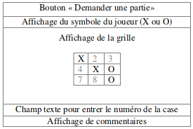
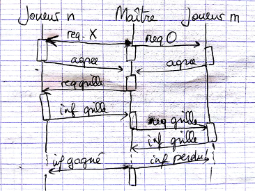

# IA04 - Médian P2014

# Exercice 1 _(7 pts)_

_1\. Donner quatre performatifs FIPA. À partir d'une proposition telle que "la route nationale RN31 est barrée", définir la signification des messages performatif + proposition._

- REQUEST : délégation d'une tâche
- INFORM : information
- FAILURE : n'a pas réussi à exécuter une tâche
- AGREE : accepte d'exécuter une tâche

Dans le cas d'un message performatif + proposition, le performatif modifie le sens de la proposition.  
INFORM + "la route nationale RN31 est barrée" signifie que l'on informe le destinataire que la route est barrée.  
REQUEST + "la route nationale RN31 est barrée" signifie que l'on demande au destinataire de barrer la route.  
QUERY IF +  "la route nationale RN31 est barrée" signifie que l'on demande au destinataire si la route est effectivement barrée.

_2\. Peut-on ajouter comme sous-behaviour d'un_ SequentialBehaviour _un_ CyclicBehaviour _? Quels seraient les avantages ? Les inconvénients ?_

On peut faire cela, mais si placé avant d'autres sous-behaviours, le CyclicBehaviour va empêcher par le fait qu'il ne termine jamais, les behaviours d'après de s'exécuter. Si placé à la suite des autres sous-behaviours, cela permet de diviser une suite d'actions devant précéder une action à exécuter en boucle, en plusieurs sous-behaviours, ce qui est plus clair au niveau de l'écriture.

_3\. Durant la conception d'un SMA, on commence en général par définir les_ use cases. _À quoi servent-il directement ? Montrer qu'ils influencent les deux étapes suivates d'analyse._

Use cases : permettent d'identifier les besoins du système et de les décrire à l'aide de scénarios. Cela permet de poser les différentes fonctionnalités du système et de diviser les besoins relatifs au système global en fonctionnalités clairement et précisément définies.  
Résultat de cette étape d'analyse : diagramme d'intéraction entre l'utilisateur et le système.

Etapes d'analyse suivantes : Identification initiale des types d'agent et Identification des responsabilités/fonctionnalités des agents.

La définition claire des fonctionnalités demandées par le système est essentielle à la réalisation des deux étapes d'analyse suivantes.

_4\. Citer trois types généraux d'agents._

- **Les agents réactifs** : faits pour réagir vite à un changement de l'environnement : se contentent de récolter de l'information dans l'environnement et d'y réagir grâce à des règles préalablement établies.

- **Les agents délibératifs** : prennent plus de temps, faits pour délibérer avant l'exécution d'une action, en se basant sur leurs objectifs ou une fonction d'utilité. La réaction peut prendre la forme d'un plan (=suite d'actions à réaliser)

- **Les agents hybrides** : réagissent comme les réactifs ou les délibératifs selon la situation.

## Exercice 2 _(3 pts)_

_Les ontologies ne sont pas au médian P18._

## Exercice 3 _(10 pts)_

### SMA
_Un SMA JADE offre la possibilité à des personnes, sur des machines différentes, de jouer au jeu du morpion. Pour cela, les personnes disposent d'une interface graphique semblable à :_

### Structure de la grille
_Chaque case de la grille comporte :_
- `X` ou `O` _si elle est occupée,_
- _Le numéro de la case si elle est libre._

### Agents
- _Maître : un agent._
- _Joueur :_ n _agents, en liaison chacun avec une interface graphique._

_L'agent maitre attend des demandes de parties de la part des agents joueurs et lance une partie dès  qu’il  a  deux  demandes ;  les  joueurs  ne  savent  pas  contre  qui  ils  jouent.  L’agent  maitre peut lancer plusieurs parties en parallèle._

_Lors  d'une  partie,  il  attribue  le  signe_  X  _au  premier  joueur  et  le  signe_  O  _à  l'autre  joueur.  Il choisit au hasard un des agents joueurs et lui envoie un message contenant la grille du jeu. Il attend  alors  le  retour  de  la  grille  de  la  part  de  ce  même  agent  complétée  du  coup  joué  et  la renvoie au second joueur ; ainsi de suite jusqu’à la fin de la partie._

_Une  grille  reçue  est  dessinée  dans  l’interface  graphique  d'un  agent  joueur.  Cet  agent  attend que la personne choisisse une case en entrant son numéro dans la zone de l’interface prévue à cet effet. Un numéro de case interdit est traité au niveau de l'agent joueur. La grille est ensuite retournée au maitre._

_C'est l'agent maitre qui gère l’arrêt de la partie ; après chaque coup, il analyse la grille, et à la fin envoie la grille accompagné d’un message approprié (« Vous avez gagné » ou « Vous avez perdu » ou « Grille pleine pas de gagnant ») à chacun des deux joueurs._

### Questions

#### Rôles et tâches des agents

_1\. Décrire en une phrase le rôle des agents joueurs et de l'agent maître._

- Les agents joueurs servent d'interface entre les personnes humaines et l'agent maître, ils lui transmettent l'évolution de la grille en fonction du coup que la personne a joué.
- L'agent maître fait le lien entre deux joueurs, comme un pigeon voyageur, en transmettant la grille complétée à chaque fois d'un symbole de plus entre les deux agents joueurs.

_2\. Décrire en une phrase les tâches (en termes de behaviour) des agents joueurs. On ne demande pas de détailler le fonctionnement du behaviour._

**Joueur** a un _Behaviour_ dans lequel il attend, complète puis renvoie une grille, jusqu'à recevoir un message du maître lui indiquant qu'il a gagné ou perdu.

_3\. De la même façon, décrire les tâches de l'agent maître._

**Maître** a un _SequentialBehaviour_ dans lequel se trouve un _OneShotBehaviour_ (initiation de la partie, choix des joueurs), et un _Behaviour_ (attente et envoi de la grille entre les joueurs, jusqu'à la complétion de la grille ou jusqu'à la victoire d'un joueur), suivi d'un _OneShotBehaviour_ pour indiquer aux deux joueurs l'issue de la partie.

#### Messages échangés

_4\. Établir un diagramme (façon agent sniffeur) des messages échangés entre les agents joueurs et l'agent maître. Préciser la nature des messages envoyés/réceptionnés._

_5\. Décrire le contenu d'un message contenant la grille de jeu._

`{{1,2,X},{O,X,O},{7,X,9}}` ? Ou tout simplement, `12XOXO7X9` étant donné qu'il n'y a qu'un caractère par case et toujours le même nombre de cases ?

OU : tableau de 9 cases ayant comme contenu soit un chiffre entre 1 et 9, soit 'X' soit 'O'. La convention du système serait que la première case du tableau serait celle en haut à gauche de la grille, puis en haut (vertical) et au milieu (horizontal) etc ... (=lecture en partant du haut et de gauche à droite).

_6\. Décrire les autres attributs utilisés pour ce type de message s'il y a lieu._

???

#### Behaviour de gestion d'une partie (agent maître)

_7\. Décrire le behaviour de gestion d'une partie._

**Maître** a un _SequentialBehaviour_ dans lequel se trouve un _OneShotBehaviour,_ un _Behaviour_ et un autre _OneShotBehaviour._

Le _OneShotBehaviour_ initialise la partie choisit un agent joueur au hasard, auquel il envoie un _REQUEST_ avec pour contenu _X ;_ il fait de même avec un autre joueur en lui envoyant _O._ Il attend ensuite leur réponse _AGREE._ Une fois celle-ci reçue, il initialise une grille, qu'il envoie au premier joueur dans un message _REQUEST._ Le deuxième _Behaviour_ s'enclenche : l'agent attend une grille _(INFORM)_ d'un joueur, puis l'envoie dans un message _REQUEST_ à l'autre joueur. Avant cet envoi, il vérifie si la partie est finie. Si elle l'est, le _Behaviour_ s'arrête pour laisser place au dernier _OneShotBehaviour,_ qui envoie un message _INFORM_ à chaque joueur, pour les informer de leur victoire et défaite respectives, et termine.

_8\. Quelles sont les informations mémorisées par ce behaviour ?_

Il s'agit des identificateurs (AID) des deux joueurs + l'identifiant du joueur actuellement en train de jouer.

#### Choix d'une case par personne

_9\. Décrire en pseudo code le behaviour déclenché après qu'une case a été choisie par une personne. Quelles informations sont transmises à l'agent joueur par la fenêtre ?_

 ???

Il s'agit du contenu de la grille.  
OU La case à jouer (son index dans le tableau) + un éventuel commentaire

#### Ajout d'une contrainte de limitation du temps de réflexion

_On limite le temps de réflexion d'un joueur à 10s, sinon il perd._

_10\. Quel est dans le système le behaviour impacté par cette limitation et pourquoi ?_

<<<<<<< HEAD
Il s'agit du _CyclicBehaviour_ de l'agent maître, car c'est le maître qui doit au bout des 10s interrompre son attente et envoyer le message de défaite au joueur.
Le CyclicBehaviour peut donc être remplacé par un TickerBehaviour qui se déclenchera toutes les 10s.

Autres modifications :
Dans les messages REQUEST envoyés par l'agent maître aux agents joueurs, on peut ajouter un champ "reply-by" qui prendrait la valeur 10 000 (10s en ms) pour indiquer aux agents qu'ils doivent répondre dans les 10s.
=======
Il s'agit du _Behaviour_ de l'agent maître, car c'est le maître qui doit au bout des 10s interrompre son attente et envoyer le message de défaite au joueur.
>>>>>>> 2b133f5eaba4f4a204d3e5271091d10a96bd555c
